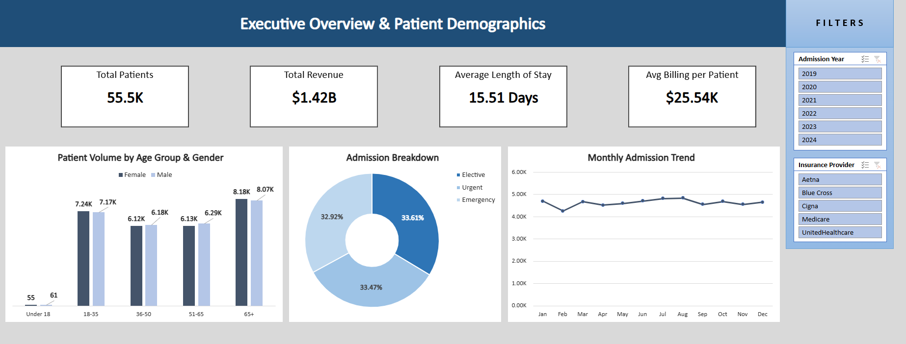
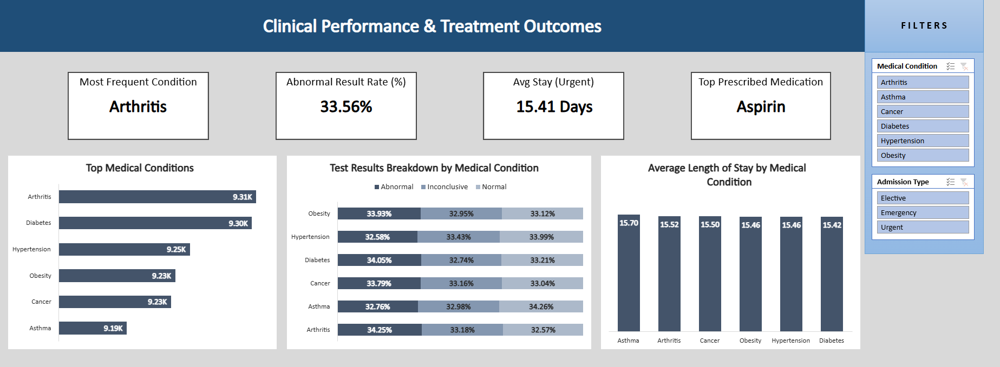
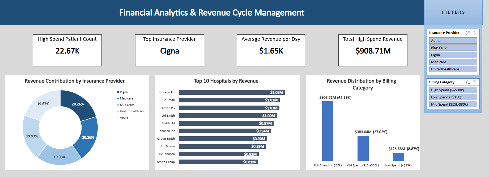

# 🏥 Healthcare Operations, Clinical Performance & Revenue Cycle Analytics

An end-to-end interactive Excel dashboard designed to evaluate healthcare performance across **55.5K patient records**. This 3-page suite provides actionable insights into executive patient demographics, clinical treatment effectiveness, and revenue cycle management.

---

## 📄 Project Deliverables
* 📥 **[Download Full Dashboard PDF](Docs/Healthcare_Data_Analyst_Dashboard.pdf)**
* 📊 **[Download Master Excel Workbook](Healthcare_Analytics_Dashboard.xlsx)**

---

## 📸 Dashboard Visual Previews

🔍 <b>Click to view Page 1: Executive Overview & Patient Demographics</b>

 

🔍 <b>Click to view Page 2: Clinical Performance & Treatment Outcomes</b>

 

🔍 <b>Click to view Page 3: Financial Analytics & Revenue Cycle Management</b>

 

---

## 📊 Executive Summary & Key Insights

### Page 1: Executive Overview & Patient Demographics
* **Patient Volume:** Analyzed **55.5K patients**, yielding **$1.42B in total revenue** with an average billing of **$25.54K per patient**.
* **Length of Stay (LOS):** Overall average stay was **15.51 days**.
* **Demographics:** Patient volume is heavily weighted toward senior demographics (**65+ age group with 16.25K+ total volume**), balanced evenly across genders.
* **Admission Types:** Emergency admissions accounted for **33.61%**, Urgent at **33.47%**, and Elective at **32.92%**.

### Page 2: Clinical Performance & Treatment Outcomes
* **Prevalent Conditions:** **Arthritis (9.31K)** and **Diabetes (9.30K)** represent the highest clinical volume.
* **Abnormal Test Rate:** **33.56% overall abnormal result rate**, with Obesity and Diabetes showing the highest proportion of abnormal findings (~34%).
* **Medications:** **Aspirin** emerged as the top prescribed medication across all treated conditions.
* **LOS by Condition:** Average stay remained consistent across conditions (~15.4 to 15.7 days), with Asthma driving the longest average length of stay (15.70 days).

### Page 3: Financial Analytics & Revenue Cycle
* **Revenue Breakdown:** High-Spend patients ($30K+) generated **$908.71M (64.11%)** of overall revenue, representing **22.67K patients**.
* **Mid-Spend Category ($15K–$30K):** Contributed **$383.04M (27.02%)** of total revenue.
* **Insurance Contribution:** Balanced revenue distribution across major providers led by **Cigna (20.26%)** and **Medicare (20.16%)**.
* **Facility Performance:** **Johnson Plc ($1.08M)** and **Llc Smith ($1.03M)** led revenue generation among top hospital facilities.

---

## 🛠️ Excel Technical Stack & Design Features
* **Dynamic KPIs & Formatting:** Custom KPI cards displaying structured volume, billing, and length of stay metrics.
* **Data Modeling & Pivot Tables:** Built structured Pivot Data layers to drive charts without breaking visual grids.
* **Interactive Slicers:** Universal sidebars enabling multi-dimensional filtering across *Admission Year*, *Insurance Provider*, *Medical Condition*, and *Billing Category*.
* **Visual Hierarchy:** Applied a zero-baseline rule on column charts, clean data label formatting, and structured layout alignment for a modern BI look.

---

## 👤 Author
**Meenakshi Singh**  
*Data Analyst | SQL Engineering | Power BI Architecture*
